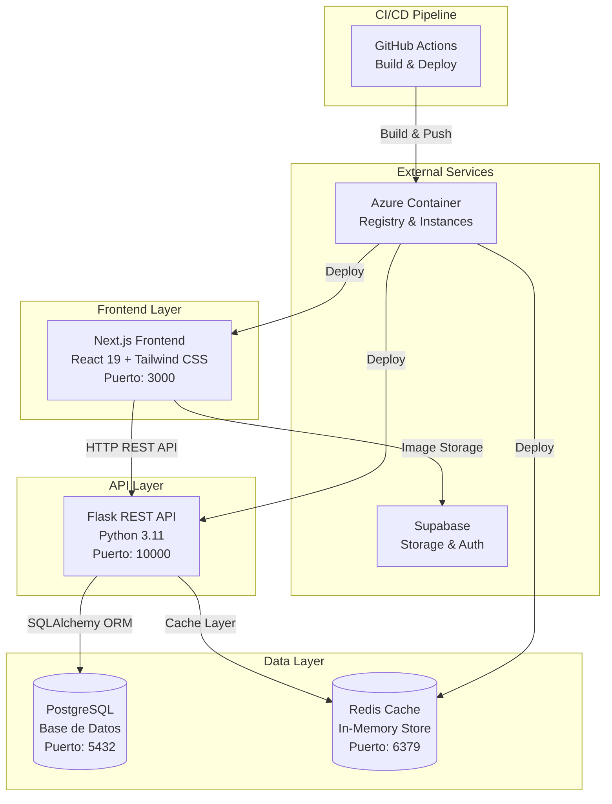
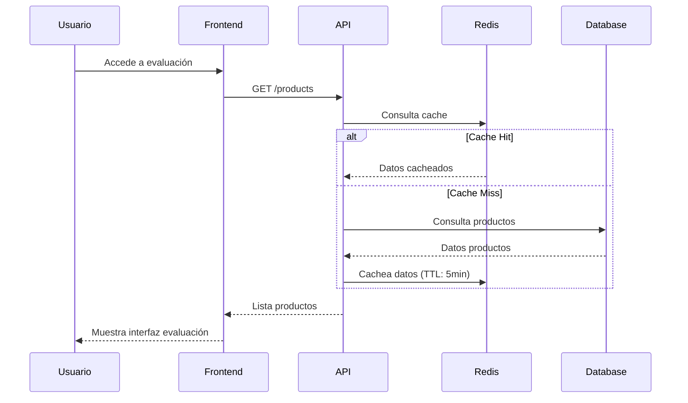
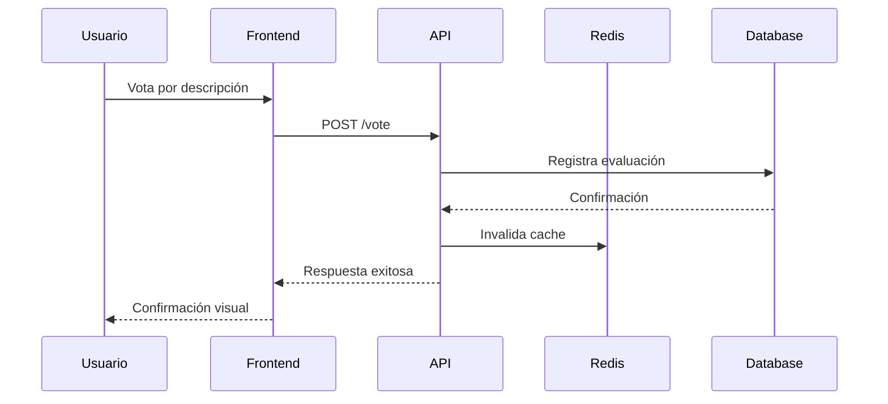
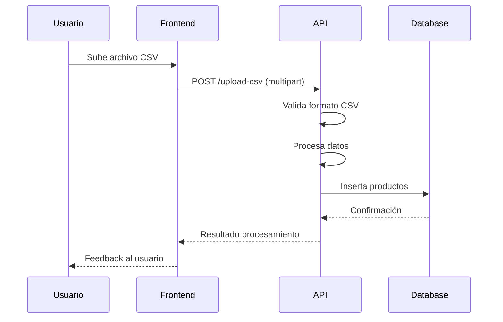

# Arquitectura del Sistema - Description-Evaluator

## Visión General de la Arquitectura

Description-Evaluator es una aplicación web de arquitectura de **microservicios containerizada** que permite evaluar y comparar descripciones de productos generadas por diferentes modelos de inteligencia artificial.

## Diagrama de Arquitectura



## Componentes del Sistema

### 1. Frontend (Next.js)

**Tecnologías:**
- Next.js 15 con App Router
- React 19 con Server Components
- Tailwind CSS 4 para estilos
- Supabase SDK para autenticación

**Responsabilidades:**
- Interfaz de usuario interactiva
- Gestión de estados con React hooks
- Comunicación con API REST
- Manejo de imágenes con Supabase
- Responsive design

**Componentes Principales:**
```
src/app/
├── page.js                 # Landing page
├── pages/
│   ├── MainTabs.jsx       # Componente principal con tabs
│   ├── DescriptionVoting.jsx  # Evaluación comparativa
│   ├── CSVUpload.jsx      # Carga de archivos
│   ├── Results.jsx        # Dashboard de resultados
│   └── CSVDownload.jsx    # Descarga de datos
└── components/
    └── Sidebar.jsx        # Navegación lateral
```

### 2. Backend API (Flask)

**Tecnologías:**
- Python 3.11
- Flask como framework web
- SQLAlchemy como ORM
- PostgreSQL como base de datos principal
- Redis para caching
- psycopg2 para conexión PostgreSQL

**Responsabilidades:**
- API REST para operaciones CRUD
- Lógica de negocio para evaluaciones
- Gestión de cache inteligente
- Procesamiento de archivos CSV
- Validación de datos

**Estructura:**
```
backend/
├── main.py              # Punto de entrada Flask
├── models.py            # Modelos SQLAlchemy
├── db.py               # Configuración base de datos
├── routes/
│   ├── product_routes.py   # Endpoints de productos
│   └── file_routes.py      # Endpoints de archivos
├── services/
│   ├── product_service.py  # Lógica de negocio productos
│   └── file_service.py     # Lógica de negocio archivos
└── tests/
    ├── test_api.py         # Tests de integración API
    └── test_model.py       # Tests unitarios modelos
```

### 3. Base de Datos (PostgreSQL)

**Esquema Relacional:**
```sql
-- Productos a evaluar
product (id, name, og_description)
    ↓ (1:N)
description (id, generated_description, product_id, model_id, condition_id)
    ↓ (N:1)
model (id, name, created_at)

-- Evaluaciones de usuarios
evaluation (id, evaluated, vote, product_id, condition_id)
    ↓ (N:1)
condition (id, description, temperature)
```

**Características:**
- Relaciones bien definidas con Foreign Keys
- Índices para optimización de consultas
- Constraints para integridad de datos
- Soporte para transacciones ACID

### 4. Cache Layer (Redis)

**Configuración:**
- Redis 6.x en memoria
- TTL de 5 minutos para datos de productos
- Invalidación automática en actualizaciones
- Configuración con password

**Estrategia de Cache:**
```python
# Cache hit - Servir desde Redis
if redis_client.exists('products'):
    return json.loads(redis_client.get('products'))

# Cache miss - Consultar DB y cachear
products = ProductService.get_all_products()
redis_client.setex('products', 300, json.dumps(products))
```

## Patrones de Arquitectura Implementados

### 1. **Microservicios**
- Separación clara entre Frontend, Backend y Cache
- Comunicación via REST API
- Escalabilidad independiente de cada servicio

### 2. **Repository Pattern**
- `ProductService` y `FileService` abstrae acceso a datos
- Separación entre lógica de negocio y persistencia
- Facilita testing y mantenimiento

### 3. **Caching Strategy**
- Cache-aside pattern con Redis
- TTL para evitar datos obsoletos
- Invalidación proactiva en actualizaciones

### 4. **Containerización**
- Cada servicio en su propio contenedor Docker
- Orquestación con Docker Compose
- Imágenes optimizadas para producción

## Flujos de Datos Principales

### 1. Evaluación de Productos


### 2. Registro de Voto


### 3. Carga de Datos CSV


## Consideraciones de Seguridad

### 1. **Autenticación y Autorización**
- Supabase maneja autenticación de usuarios
- JWT tokens para sesiones
- Roles y permisos granulares

### 2. **Validación de Datos**
- Validación en frontend y backend
- Sanitización de inputs
- Validación de tipos de archivos

### 3. **Comunicación Segura**
- HTTPS en producción
- Validación de CORS
- Headers de seguridad

### 4. **Secrets Management**
- Variables de entorno para credenciales
- GitHub Secrets para CI/CD
- Azure Key Vault en producción

## Performance y Escalabilidad

### 1. **Optimizaciones Frontend**
- Server-side rendering con Next.js
- Code splitting automático
- Optimización de imágenes
- Progressive Web App capabilities

### 2. **Optimizaciones Backend**
- Connection pooling SQLAlchemy
- Eager loading para reducir N+1 queries
- Índices de base de datos
- Cache inteligente con Redis

### 3. **Estrategias de Escalabilidad**
- Containerización para escalado horizontal
- Load balancing con múltiples instancias
- CDN para contenido estático
- Database read replicas

## Monitoreo y Observabilidad

### 1. **Logging**
- Logs estructurados en JSON
- Diferentes niveles de log (DEBUG, INFO, ERROR)
- Agregación de logs con herramientas cloud

### 2. **Métricas**
- Métricas de aplicación (requests/sec, latencia)
- Métricas de infraestructura (CPU, memoria)
- Health checks para cada servicio

### 3. **Alerting**
- Alertas basadas en métricas críticas
- Notificaciones de errores 5xx
- Monitoreo de uptime

## Disaster Recovery

### 1. **Backup Strategy**
- Backups automáticos de PostgreSQL
- Replicación de datos críticos
- Snapshots de volúmenes Docker

### 2. **High Availability**
- Multi-region deployment
- Database failover automático
- Circuit breakers para servicios externos

## Roadmap Técnico

### Corto Plazo (1-3 meses)
- [ ] Rate limiting en API
- [ ] Health checks endpoints
- [ ] Database migrations automáticas
- [ ] Error tracking (Sentry)

### Medio Plazo (3-6 meses)
- [ ] Microservicios adicionales (Analytics, Notifications)
- [ ] Event-driven architecture con message queues
- [ ] Real-time updates con WebSockets
- [ ] A/B testing framework

### Largo Plazo (6+ meses)
- [ ] Machine Learning pipeline para análisis de descripciones
- [ ] Multi-tenant architecture
- [ ] Advanced analytics y reporting
- [ ] Mobile applications (React Native)

---

**Última actualización:** Diciembre 2024  
**Versión de arquitectura:** 1.0.0