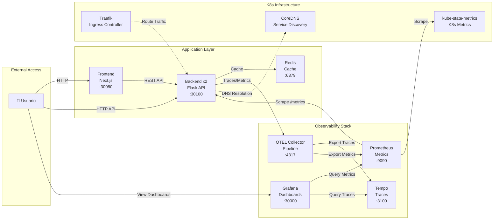
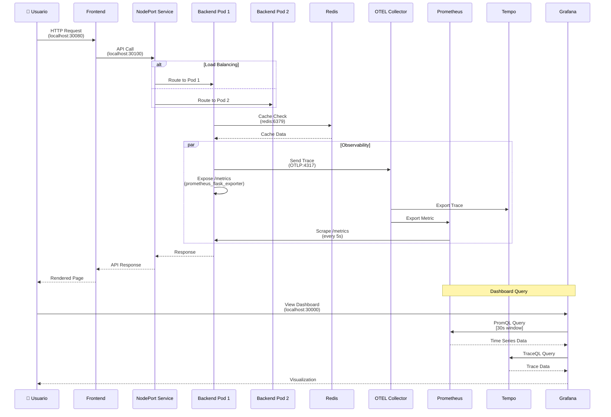
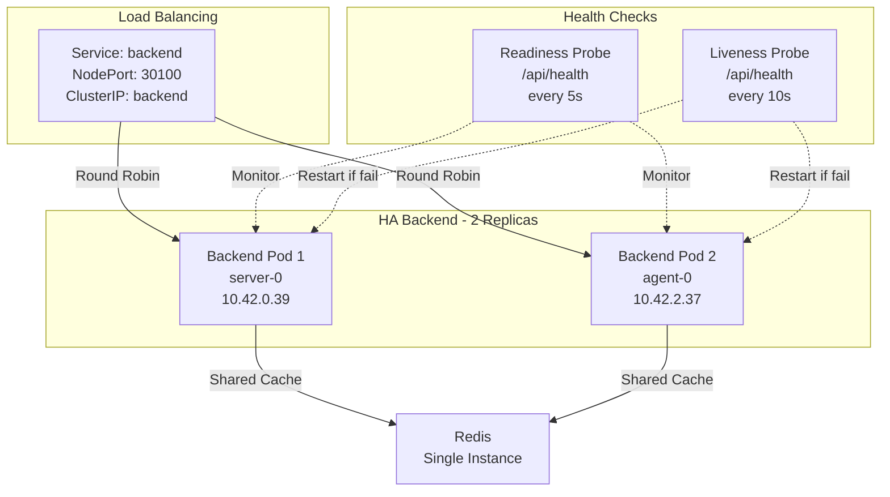
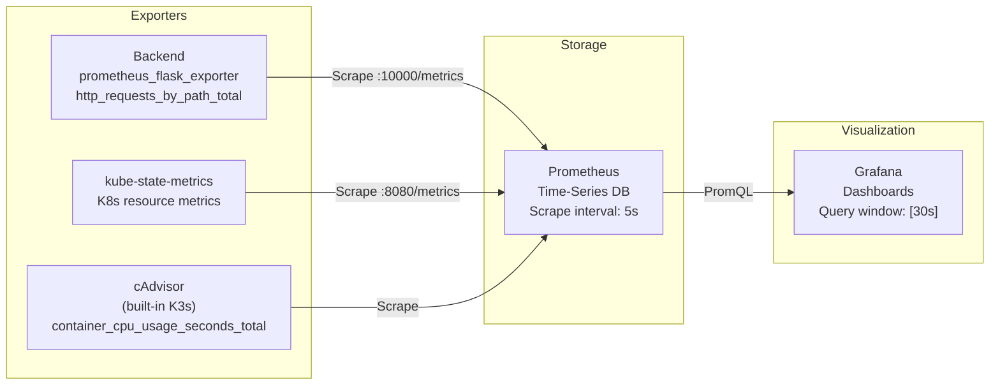
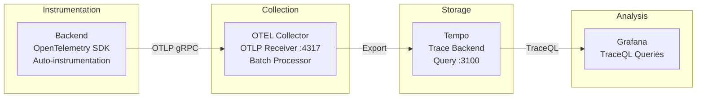
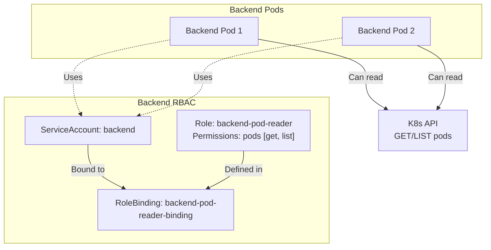

# Arquitectura del Sistema - Description Evaluator

## Cluster Kubernetes con Observabilidad y Alta Disponibilidad

---

## 📊 Visión General del Cluster

```mermaid
graph TB
    subgraph "K3d Cluster - tp2-cluster"
        subgraph "Control Plane Node"
            SERVER["🎯 k3d-tp2-cluster-server-0<br/>ROLE: control-plane, master<br/>IP: 172.18.0.2"]

            subgraph "Pods en Server Node"
                BACK1["backend-965f5ff86-ms6zt<br/>📦 Replica 1<br/>IP: 10.42.0.39"]
                FRONT["frontend-7d8dd94ccf-64k5s<br/>🌐 Next.js UI<br/>IP: 10.42.0.32"]
                GRAF["grafana-68cd4bdbbb-bnv2n<br/>📈 Visualización<br/>IP: 10.42.0.40"]
                SVCLB1["svclb-traefik<br/>⚖️ Load Balancer<br/>IP: 10.42.0.30"]
            end
        end

        subgraph "Worker Node 1"
            AGENT0["🔧 k3d-tp2-cluster-agent-0<br/>ROLE: worker<br/>IP: 172.18.0.5"]

            subgraph "Pods en Agent-0"
                BACK2["backend-965f5ff86-q9b86<br/>📦 Replica 2<br/>IP: 10.42.2.37"]
                OTEL["otel-collector<br/>🔭 Telemetry<br/>IP: 10.42.2.38"]
                REDIS["redis-6fbd565ddb-bgm6l<br/>💾 Cache<br/>IP: 10.42.2.32"]
                TEMPO["tempo-7555f6bd7d-dvc7v<br/>🔍 Traces<br/>IP: 10.42.2.33"]
                COREDNS["coredns<br/>🌐 DNS<br/>IP: 10.42.2.29"]
                METRICS["metrics-server<br/>📊 Metrics<br/>IP: 10.42.2.26"]
                SVCLB2["svclb-traefik<br/>⚖️ Load Balancer<br/>IP: 10.42.2.31"]
            end
        end

        subgraph "Worker Node 2"
            AGENT1["🔧 k3d-tp2-cluster-agent-1<br/>ROLE: worker<br/>IP: 172.18.0.3"]

            subgraph "Pods en Agent-1"
                KSMTX["kube-state-metrics<br/>📊 K8s Metrics<br/>IP: 10.42.1.24"]
                PROM["prometheus-75f754f445-s69xl<br/>📉 Time Series DB<br/>IP: 10.42.1.23"]
                LOCALPATH["local-path-provisioner<br/>💿 Storage<br/>IP: 10.42.1.19"]
                TRAEFIK["traefik<br/>🚪 Ingress<br/>IP: 10.42.1.18"]
                SVCLB3["svclb-traefik<br/>⚖️ Load Balancer<br/>IP: 10.42.1.21"]
            end
        end
    end

    subgraph "Host Machine"
        HOST["🖥️ Windows Host<br/>WSL2 Kernel<br/>Docker Desktop"]
    end

    HOST -.->|Port 30000| GRAF
    HOST -.->|Port 30080| FRONT
    HOST -.->|Port 30100| BACK1
    HOST -.->|Port 30100| BACK2
```



---

## 🏗️ Arquitectura de Comunicación



---

## 🔄 Flujo de Datos Detallado



---

## 📦 Distribución de Pods por Nodo

### **Control Plane Node** (k3d-tp2-cluster-server-0)

| Pod                       | Tipo           | Replicas | Puerto | Propósito                  |
| ------------------------- | -------------- | -------- | ------ | -------------------------- |
| backend-965f5ff86-ms6zt   | Application    | 1/2      | 10000  | Flask API - Replica 1      |
| frontend-7d8dd94ccf-64k5s | Application    | 1/1      | 80     | Next.js UI                 |
| grafana-68cd4bdbbb-bnv2n  | Observability  | 1/1      | 3000   | Visualización de métricas  |
| svclb-traefik             | Infrastructure | 2/2      | -      | Load balancer para Traefik |

**Características:**

- ✅ Roles: `control-plane`, `master`
- ✅ Maneja el API Server de Kubernetes
- ✅ Aloja 1 réplica del backend para HA
- ✅ Frontend concentrado aquí para acceso rápido

---

### **Worker Node 1** (k3d-tp2-cluster-agent-0)

| Pod                             | Tipo           | Replicas | Puerto | Propósito                  |
| ------------------------------- | -------------- | -------- | ------ | -------------------------- |
| backend-965f5ff86-q9b86         | Application    | 1/2      | 10000  | Flask API - Replica 2      |
| otel-collector-5d8f5777cb-sl8mm | Observability  | 1/1      | 4317   | Pipeline de telemetría     |
| redis-6fbd565ddb-bgm6l          | Database       | 1/1      | 6379   | Cache en memoria           |
| tempo-7555f6bd7d-dvc7v          | Observability  | 1/1      | 3100   | Almacenamiento de trazas   |
| coredns                         | Infrastructure | 1/1      | 53     | DNS interno                |
| metrics-server                  | Infrastructure | 1/1      | 443    | Métricas de recursos K8s   |
| svclb-traefik                   | Infrastructure | 2/2      | -      | Load balancer para Traefik |

**Características:**

- ✅ Worker node principal
- ✅ Mayor concentración de pods (7 pods)
- ✅ Contiene toda la infraestructura de storage (Redis, Tempo)
- ✅ Segunda réplica del backend para HA

---

### **Worker Node 2** (k3d-tp2-cluster-agent-1)

| Pod                                 | Tipo           | Replicas | Puerto | Propósito                  |
| ----------------------------------- | -------------- | -------- | ------ | -------------------------- |
| kube-state-metrics-5fc5c89cdf-mmvvb | Observability  | 1/1      | 8080   | Métricas de estado de K8s  |
| prometheus-75f754f445-s69xl         | Observability  | 1/1      | 9090   | Time-series database       |
| local-path-provisioner              | Infrastructure | 1/1      | -      | Provisioner de volúmenes   |
| traefik-5d45fc8cc9-vv8hg            | Infrastructure | 1/1      | 80/443 | Ingress controller         |
| svclb-traefik                       | Infrastructure | 2/2      | -      | Load balancer para Traefik |

**Características:**

- ✅ Worker node secundario
- ✅ Dedicado a observabilidad (Prometheus, kube-state-metrics)
- ✅ Maneja el ingress (Traefik)
- ✅ Storage provisioning

---

## 🎯 Alta Disponibilidad (HA) - Estrategia



**Garantías de HA:**

1. **2 réplicas del backend** distribuidas en nodos diferentes
2. **Readiness probes cada 5s** - Tráfico solo a pods sanos
3. **Liveness probes cada 10s** - Auto-restart si falla
4. **NodePort Service** con balanceo round-robin automático
5. **Anti-affinity implícito** - Kubernetes distribuye pods en nodos diferentes cuando es posible

---

## 📊 Stack de Observabilidad

### Métricas (Prometheus Stack)



**Métricas Clave Monitoreadas:**

- ✅ **CPU Usage**: `rate(container_cpu_usage_seconds_total[30s])`
- ✅ **Memory Usage**: `container_memory_usage_bytes`
- ✅ **RPS (All)**: `rate(http_requests_by_path_total[30s])`
- ✅ **RPS (Business)**: `rate(http_requests_by_path_total{path!~"/api/health|/metrics"}[30s])`
- ✅ **Latency p95/p50**: `histogram_quantile(0.95, rate(flask_http_request_duration_seconds_bucket[30s]))`
- ✅ **Pod Restarts**: `kube_pod_container_status_restarts_total`

---

### Trazas (OpenTelemetry + Tempo)



**Información Capturada:**

- ✅ **Trace ID**: Identificador único de request
- ✅ **Span ID**: Segmentos de operación
- ✅ **Duration**: Tiempo de ejecución
- ✅ **Status**: Success/Error
- ✅ **Attributes**: method, path, status_code

---

## 🌐 Exposición de Servicios

### NodePort Services

| Servicio     | Puerto Interno | NodePort | Propósito  | Acceso                 |
| ------------ | -------------- | -------- | ---------- | ---------------------- |
| **Frontend** | 80             | 30080    | Next.js UI | http://localhost:30080 |
| **Backend**  | 10000          | 30100    | Flask API  | http://localhost:30100 |
| **Grafana**  | 3000           | 30000    | Dashboards | http://localhost:30000 |

### ClusterIP Services (Solo interno)

| Servicio           | Puerto | Tipo      | Consumidores |
| ------------------ | ------ | --------- | ------------ |
| **redis**          | 6379   | ClusterIP | Backend pods |
| **prometheus**     | 9090   | ClusterIP | Grafana      |
| **tempo**          | 3100   | ClusterIP | Grafana      |
| **otel-collector** | 4317   | ClusterIP | Backend pods |

---

## 🔒 Seguridad y RBAC



**Configuración de Seguridad:**

- ✅ **ServiceAccount dedicado** para el backend
- ✅ **Role con permisos mínimos** (solo lectura de pods)
- ✅ **RoleBinding** explícito
- ✅ **Secrets para credenciales** (backend-secrets)
- ✅ **Aislamiento de red** ClusterIP para servicios internos

---

## 📈 Métricas Personalizadas del Backend

### Instrumentación Manual con prometheus_client

```python
from prometheus_client import Counter

# Counter con labels: method, path, status
http_requests_by_path_total = Counter(
    'http_requests_by_path_total',
    'Total HTTP requests by path',
    ['method', 'path', 'status']
)

@app.before_request
def before_request():
    request.start_time = time.time()

@app.after_request
def after_request(response):
    request_latency = time.time() - request.start_time
    http_requests_by_path_total.labels(
        method=request.method,
        path=request.path,
        status=response.status_code
    ).inc()
    return response
```

**Por qué manual?**

- ❌ `prometheus_flask_exporter` no soporta labels de path (solo method+status)
- ✅ Labels personalizados evitan explosión de cardinalidad
- ✅ Control total sobre qué paths se tracean
- ✅ Permite filtrar health checks en queries: `path!~"/api/health|/metrics"`

---

## 🔧 Configuración de Recursos

### Backend (Flask API)

```yaml
resources:
  requests:
    memory: "256Mi" # Mínimo garantizado
    cpu: "100m" # 0.1 core
  limits:
    memory: "512Mi" # Límite para testing OOMKilled
    cpu: "500m" # 0.5 core máximo
```

### Frontend (Next.js)

```yaml
resources:
  requests:
    memory: "128Mi"
    cpu: "100m"
  limits:
    memory: "256Mi"
    cpu: "250m"
```

### Redis (Cache)

```yaml
resources:
  requests:
    memory: "128Mi"
    cpu: "100m"
  limits:
    memory: "256Mi"
    cpu: "250m"
```

---

## 🚀 Proceso de Deploy y Restart

### Startup completo

```bash
# 1. Crear cluster k3d
k3d cluster create tp2-cluster \
  --servers 1 \
  --agents 2 \
  --port "30080:30080@server:0" \
  --port "30100:30100@server:0" \
  --port "30000:30000@server:0"

# 2. Importar imágenes
k3d image import devopsregistrytp.azurecr.io/backend:latest -c tp2-cluster
k3d image import devopsregistrytp.azurecr.io/frontend:latest -c tp2-cluster

# 3. Deploy aplicación
kubectl apply -f k8s/app/redis.yaml
kubectl apply -f k8s/app/backend.yaml
kubectl apply -f k8s/app/frontend.yaml

# 4. Deploy observabilidad
kubectl apply -f k8s/observability/prometheus.yaml
kubectl apply -f k8s/observability/tempo.yaml
kubectl apply -f k8s/observability/otel-collector.yaml
kubectl apply -f k8s/observability/grafana.yaml
kubectl apply -f k8s/observability/kube-state-metrics.yaml
```

### Restart después de reinicio de PC

```bash
# Reiniciar todos los deployments
kubectl rollout restart deployment backend
kubectl rollout restart deployment frontend
kubectl rollout restart deployment redis
kubectl rollout restart deployment grafana
kubectl rollout restart deployment prometheus
kubectl rollout restart deployment tempo
kubectl rollout restart deployment otel-collector
kubectl rollout restart deployment kube-state-metrics

# Verificar estado
kubectl get pods
kubectl get nodes
```

---

## 🎨 Paneles de Grafana

### Dashboard: Backend Monitoring

#### **Panel 1: CPU Usage**

- Query: `rate(container_cpu_usage_seconds_total{pod=~"backend.*", container="backend"}[30s]) * 100`
- Window: **30s**
- Propósito: Uso de CPU en porcentaje por pod

#### **Panel 2: Memory Usage**

- Query: `container_memory_usage_bytes{pod=~"backend.*", container="backend"} / (1024 * 1024)`
- Propósito: Uso de memoria en MB por pod

#### **Panel 3: Requests per Second - All Metrics**

- Query: `rate(http_requests_by_path_total[30s])`
- Window: **30s**
- Incluye: `/api/health`, `/metrics`, endpoints de negocio

#### **Panel 4: Requests per Second - Business Only**

- Query: `rate(http_requests_by_path_total{path!~"/api/health|/metrics"}[30s])`
- Window: **30s**
- Filtra: Health checks y scraping de métricas

#### **Panel 5: Request Latency (p95 & p50)**

- Query p95: `histogram_quantile(0.95, rate(flask_http_request_duration_seconds_bucket[30s]))`
- Query p50: `histogram_quantile(0.50, rate(flask_http_request_duration_seconds_bucket[30s]))`
- Window: **30s**
- Propósito: Latencia percentil 95 y mediana

#### **Panel 6: Pod Restarts**

- Query: `kube_pod_container_status_restarts_total{pod=~"backend.*"}`
- Propósito: Contador de reinicios por pod (debugging)

#### **Panel 7: Business Endpoints - Requests/min**

- Query /products: `rate(flask_http_request_total{path="/products"}[30s]) * 60`
- Query /vote: `rate(flask_http_request_total{path="/vote"}[30s]) * 60`
- Window: **30s**
- Propósito: RPM de endpoints críticos

#### **Panel 8: Business Endpoints - Latency p95**

- Query /products: `histogram_quantile(0.95, rate(flask_http_request_duration_seconds_bucket{path="/products"}[30s]))`
- Query /vote: `histogram_quantile(0.95, rate(flask_http_request_duration_seconds_bucket{path="/vote"}[30s]))`
- Window: **30s**
- Propósito: Latencia por endpoint específico

**Nota:** Todas las ventanas son de **30 segundos** para dashboards más responsivos y reactivos.

---

## 🔍 Troubleshooting

### Problema: Pods en CrashLoopBackOff

**Causa:** Pérdida de estado después de reinicio de PC  
**Solución:**

```bash
kubectl rollout restart deployment <nombre>
# o eliminar pods manualmente
kubectl delete pod <pod-name>
```

### Problema: Duplicación de métricas en Grafana

**Causa:** Cada pod tiene container="backend" + container="POD" (pause container)  
**Solución:** Filtrar queries con `container="backend"`

```promql
rate(container_cpu_usage_seconds_total{pod=~"backend.*", container="backend"}[30s])
```

### Problema: Gráfico de sierra en RPS

**Causa:** Health checks periódicos (readiness 5s + liveness 10s) + scraping 5s  
**Comportamiento esperado:** ~0.3 req/s baseline  
**No es un bug** - Es el patrón normal de health checks

### Problema: Backend no responde

**Verificación:**

```bash
# Health check manual
curl http://localhost:30100/api/health
# Esperado: {"redis":"connected","status":"healthy"}

# Ver logs
kubectl logs -f <backend-pod-name>
```

---

## 📚 Tecnologías y Versiones

| Componente         | Versión      | Propósito             |
| ------------------ | ------------ | --------------------- |
| **K3s**            | v1.31.5+k3s1 | Kubernetes ligero     |
| **k3d**            | v5.8.3       | Wrapper k3s en Docker |
| **containerd**     | 1.7.23-k3s2  | Container runtime     |
| **Python**         | 3.10-slim    | Backend runtime       |
| **Flask**          | Latest       | Web framework         |
| **Next.js**        | 14+          | Frontend framework    |
| **Redis**          | 7.2          | In-memory cache       |
| **Prometheus**     | Latest       | Metrics storage       |
| **Grafana**        | Latest       | Visualization         |
| **Tempo**          | Latest       | Trace storage         |
| **OTEL Collector** | Latest       | Telemetry pipeline    |

---

## 🎯 Características Clave

### ✅ Alta Disponibilidad

- 2 réplicas del backend en nodos separados
- Health checks automáticos cada 5-10s
- Auto-restart en caso de fallas

### ✅ Observabilidad Completa

- Métricas custom con prometheus_client
- Trazas distribuidas con OpenTelemetry
- Dashboards en tiempo real (30s refresh)
- Separación de métricas de negocio vs infraestructura

### ✅ Escalabilidad

- Arquitectura stateless (backend)
- Cache compartido (Redis)
- Load balancing automático
- Fácil scale horizontal: `kubectl scale deployment backend --replicas=3`

### ✅ Resiliencia

- Resource limits para prevenir noisy neighbors
- Liveness/Readiness probes
- RBAC con permisos mínimos
- Secrets para credenciales sensibles

---

## 📝 Notas de Implementación

### Ventanas de Tiempo en Queries

**Decisión:** Todas las queries usan `[30s]` window

- ✅ Más responsive que [1m] o [5m]
- ✅ Balance entre granularidad y carga
- ⚠️ Mayor uso de recursos Prometheus
- 📊 Dashboards actualizan cada 30s

### Instrumentación Manual

**Decisión:** Counter manual en lugar de group_by

```python
# ❌ No funciona
PrometheusMetrics(app, group_by='path')

# ✅ Solución
http_requests_by_path_total.labels(method, path, status).inc()
```

### Distribución de Pods

**Decisión:** Kubernetes auto-distribución

- Backend: 1 pod en server-0, 1 pod en agent-0
- Frontend: Solo en server-0 (acceso rápido)
- Observabilidad: Distribuida en agent-0 y agent-1
- Redis/Tempo: Concentrados en agent-0

---

## 🚦 Estado Actual del Sistema

```
✅ Cluster: k3d-tp2-cluster (3 nodos, 39h uptime)
✅ Pods: 16 total (14 Running + 2 system)
✅ Backend: 2/2 replicas Running
✅ Frontend: 1/1 replica Running
✅ Observabilidad: 4/4 herramientas Running
✅ Infraestructura: 5/5 servicios Running

🌐 Acceso:
- Frontend: http://localhost:30080
- Backend API: http://localhost:30100
- Grafana: http://localhost:30000
```

---

## 🎓 Conclusiones

Esta arquitectura demuestra:

1. **HA real** con múltiples réplicas distribuidas
2. **Observabilidad completa** con métricas custom y trazas
3. **Resiliencia** mediante health checks y auto-restart
4. **Escalabilidad** con arquitectura stateless
5. **Best practices K8s** con RBAC, resources, probes

**Trade-offs considerados:**

- Redis sin HA (1 replica) - Punto único de falla aceptable para cache
- Frontend sin HA (1 replica) - Aplicación estática, menos crítico
- Ventanas cortas (30s) - Más carga, mejor UX

**Mejoras futuras:**

- Redis Sentinel para HA del cache
- Horizontal Pod Autoscaler (HPA)
- Network Policies para mayor seguridad
- Persistent Volumes para Prometheus/Tempo
